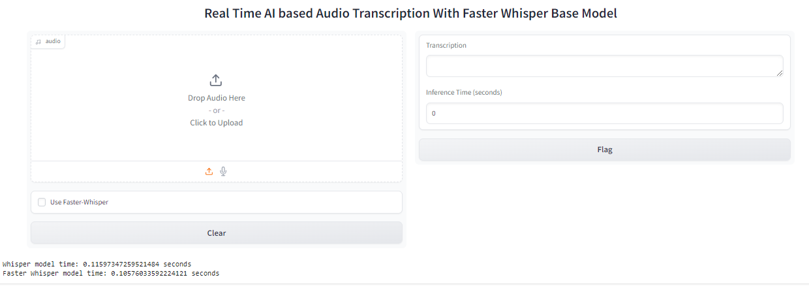
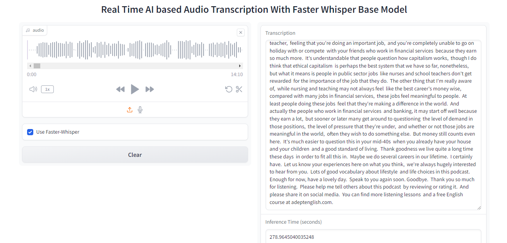

# Real-Time AI-Based Audio Transcription with Whisper and Faster Whisper

This repository demonstrates a real-time audio transcription system using two AI models: the standard Whisper model and the Faster Whisper model. Both models are executed in parallel to evaluate their performance, transcription accuracy, and inference time. The project leverages Gradio for an interactive user interface.

## Features

- **Real-Time Audio Transcription**: Transcribe audio inputs in real time.
- **Dual-Model Evaluation**: Compare the transcription performance of the standard Whisper model and Faster Whisper model running in parallel.
- **Performance Metrics**: Measure and display Word Error Rate (WER), Character Error Rate (CER), and BLEU Score for both models.
- **Inference Time Analysis**: Examine and compare the time taken by each model to generate transcriptions.
- **Interactive UI**: Utilize Gradio to provide a user-friendly interface for live audio input and transcription.

## Getting Started

### Prerequisites

1. **Python**: Ensure Python 3.7 or higher is installed.
2. **Dependencies**: Install required libraries:
    ```bash
    pip install whisper faster-whisper gradio numpy
    ```
3. **Virtual Environment** (Recommended):
    ```bash
    python -m venv venv
    source venv/bin/activate  # On Windows: venv\Scripts\activate
    ```

### Installation
1. Clone the repository:
    ```bash
    git clone https://github.com/your-username/Real-Time-AI-Audio-Transcription.git
    cd Real-Time-AI-Audio-Transcription
    ```
2. Install additional dependencies (if any):
    ```bash
    pip install -r requirements.txt
    ```

### Easily Access: Google Colab

  ```bash
    Final_Whisper_and_Fast_whisper.ipynb
    ```

## Usage

### Running the Application

1. Launch the transcription system:
    ```bash
    python app.py
    ```
2. Access the Gradio interface in your browser (typically at `http://127.0.0.1:7860/`).

### Input Options
- **Live Audio**: Use your microphone to provide real-time audio input.
- **Uploaded Files**: Upload pre-recorded audio files for transcription.

### Output
- Transcriptions from both models.
- Performance metrics (WER, CER, BLEU Score) displayed separately for each model.
- Inference time comparison.

## Evaluation Methodology

1. **Parallel Execution**: The system runs both the standard Whisper model and Faster Whisper model simultaneously.
2. **Accuracy Assessment**: Calculates WER, CER, and BLEU Score to compare transcription quality.
3. **Inference Time**: Measures and logs the time taken by each model to generate transcriptions.

## Results

### Transcription Results


### Inference Time Comparison


## File Structure


## Future Improvements

- Incorporate additional AI transcription models for comparison.
- Extend Gradio UI with more visualization options.
- Optimize system performance for longer audio files.

## Contributing

Contributions are welcome! Please fork the repository and submit a pull request with your changes.

## License

This project is licensed under the MIT License. See the LICENSE file for details.

## Acknowledgments

- [OpenAI Whisper](https://openai.com/whisper)
- [Faster Whisper](https://github.com/guillaumekln/faster-whisper)
- [Gradio](https://gradio.app)

